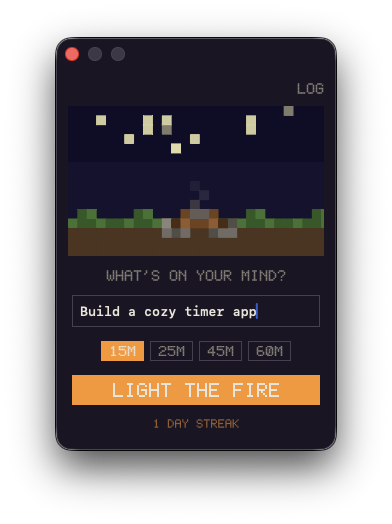
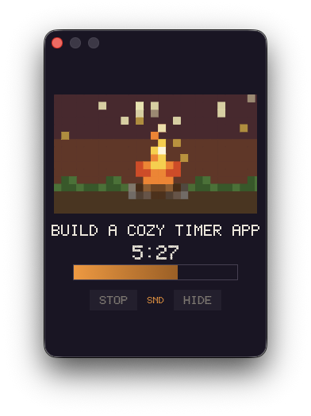
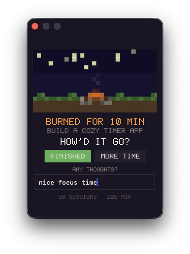
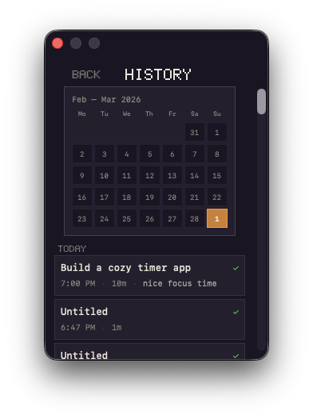

<p align="center">
  
</p>

<p align="center">
  <strong>A tiny cozy focus timer that lives in your macOS Dock.</strong>
</p>

<p align="center">
  
  
  
  
</p>

---

Fireplace is a focus timer for macOS. You name your task, pick a duration, and a pixel-art campfire lights up in your Dock. Stars twinkle. Sound plays. When the fire dies down, it asks you how it went.

The entire interface is pixel art. Every button, every label, every progress bar. It looks and feels like a game from 2003, but it runs on Sonoma.

No dashboards. No analytics. No subscriptions. Just a campfire.

---

## Screenshots

<p align="center">
  
  &nbsp;&nbsp;
  
  &nbsp;&nbsp;
  
</p>

<p align="center">
  
  &nbsp;&nbsp;&nbsp;
  
  &nbsp;&nbsp;&nbsp;
  
</p>

---

## How it works

1. **Name your task** and pick a duration (15m, 25m, 45m, or 60m).
2. **Hit "Light the fire."** A campfire burns in your Dock. A progress bar counts down. Ambient sound plays if you want it.
3. **When time is up,** the fire dies to embers. You are asked: "How'd it go?" Tap Finished or Need more time.

That is the whole app.

---

## Quick start

```bash
git clone https://github.com/your-username/fireplace.git
cd fireplace
swift run
```

Or open in Xcode:

```bash
open Package.swift
```

Requires macOS 14 (Sonoma) or later and Xcode 15+.

---

## Features

### Campfire

The Dock icon is a 32x32 pixel-art campfire with night sky, twinkling stars, flickering flames, and floating sparks. It animates at 4 FPS. The fire grows from a spark when you start a session and dies down with rising smoke when time is up. Stars drift across the sky as time passes. The fire visually shrinks in the last 20% of your session.

### Pixel art UI

The entire interface uses a custom 5x7 bitmap font and pixel-art controls. Buttons have 1px borders. The progress bar is a horizontal fill bar. Duration chips are pixel-bordered rectangles. The panel has a solid dark background. No rounded corners, no system controls, no blur. It looks like one cohesive world.

### Ambient sound mixer

Click the flame icon in the menu bar to open a sound mixer. Four layers: fire, rain, wind, and noise. Each has a toggle and a volume slider. The sound engine uses proper DSP: Voss-McCartney pink noise, IIR band-pass filters, slow amplitude modulation, Poisson-distributed crackle events, and stereo decorrelation. All audio is synthesized at runtime. Zero audio files in the repo. The mixer works independently of focus sessions.

### Session history

A 30-day calendar shows your focus activity. Days with sessions are highlighted in orange. Sessions are grouped by day with task name, duration, finished status, and journal entry. A weekly summary appears on the completion screen.

### macOS integration

The app lives in both the Dock and the menu bar. Right-click the Dock icon for quick-start presets and session info. The panel dismisses on outside click. Quitting during a session shows a confirmation dialog and saves the partial session. Keyboard navigation works throughout: Tab, arrow keys, Enter.

### Details

When you tap "Need more time" on the completion screen, you can pick a new duration and relight the same task without retyping it. Consecutive-day streaks are tracked with notch marks on the campfire stones. Type "marshmallow" as your task name and a pixel marshmallow appears by the fire.

---

## Architecture

```
Fireplace/
├── FireplaceApp.swift              App lifecycle, Dock menu, state wiring
├── AppState.swift                  @Observable state machine, streak tracker
├── SessionHistory.swift            Session persistence (UserDefaults/JSON)
│
├── Panel/
│   ├── FloatingPanel.swift         NSPanel (solid dark bg, non-activating)
│   └── PanelController.swift       Panel positioning, all view states
│
├── Views/
│   ├── SetupView.swift             Task input, duration chips, start button
│   ├── SettingsView.swift          Ambient sound configuration
│   ├── HistoryView.swift           Calendar and session log
│   ├── PixelText.swift             5x7 bitmap font renderer
│   ├── PixelUI.swift               Pixel buttons, text fields, progress bar
│   └── FireplaceCanvasView.swift   16-row pixel-art canvas (panel)
│
├── DockTile/
│   ├── DockIconCanvasView.swift    32x32 pixel-art canvas (Dock icon)
│   ├── StaticCampfireIcon.swift    Static frame for About and Cmd-Tab
│   └── DockTileRenderer.swift      Frame rendering to dockTile.contentView
│
├── Timer/
│   └── FocusTimer.swift            Countdown with progress tracking
│
├── Sound/
│   └── CracklingSound.swift        Multi-layer DSP ambient engine
│
├── MenuBar/
│   └── MenuBarCompanion.swift      Status bar icon and sound popover
│
└── Package.swift
```

### State machine

```
idle → lightingUp → focusing → dyingDown → completed → idle
```

| State | What happens |
|---|---|
| Idle | Cold campfire, drifting smoke. Setup UI visible. |
| Lighting up | Flames grow from a spark over 1 second. |
| Focusing | Full fire. Progress bar counts down. Sound plays. |
| Dying down | Fire shrinks, smoke rises. Sound fades out. |
| Completed | Embers pulse. Dock bounces. Reflection prompt appears. |

### Sound engine

| Layer | Noise type | Band-pass | Modulation | Events |
|---|---|---|---|---|
| Fire | Pink + brown | 300 to 3kHz | 0.08Hz breathing | Poisson crackles |
| Rain | White | 1k to 8kHz | 0.05Hz density | Tonal droplet plinks |
| Wind | Pink (stereo) | 100 to 1kHz | Dual LFO swells | None |
| Noise | Pink (Voss-McCartney) | 200 to 6kHz | None | None |

All audio is stereo WAV at 44.1kHz. 10-second loops with smoothstep crossfade at boundaries. Soft tanh limiter on output.

### Tech

- Swift 5.10, SwiftUI with AppKit integration
- macOS 14+ (Sonoma)
- `@Observable` and `withObservationTracking` for reactive state
- SwiftUI `Canvas` and `ImageRenderer` for pixel-art rendering
- `AVAudioPlayer` with runtime-synthesized WAV data
- Custom 5x7 bitmap font (A-Z, 0-9, punctuation)
- Zero external dependencies
- About 2,600 lines of Swift across 16 source files

---

## Contributing

Fireplace is intentionally small. Contributions are welcome if they keep the spirit: simple, cozy, no feature creep.

- **Bug fixes** are always welcome.
- **New ambient layers** can be added by extending `AmbientLayer` and implementing the DSP generator in `CracklingSound.swift`.
- **Pixel art improvements** go in `FireplaceCanvasView.swift` (panel) or `DockIconCanvasView.swift` (Dock). Every pixel is a function call.
- **Bitmap font glyphs** can be added in `PixelFont.glyphs` inside `PixelText.swift`.

---

## License

[MIT](LICENSE)
